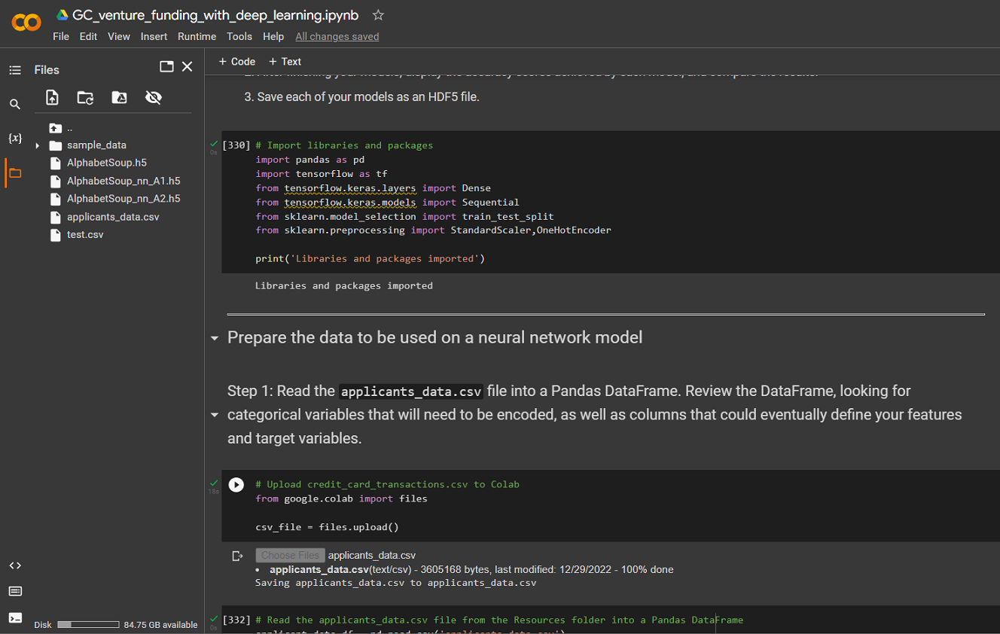
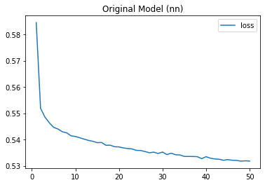
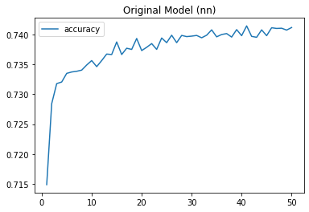
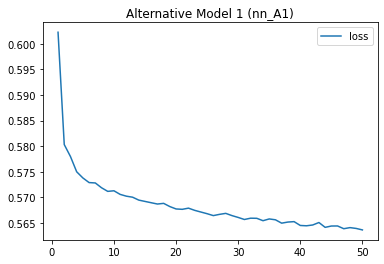
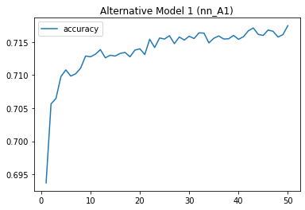
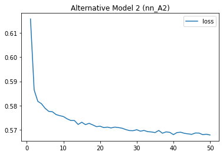
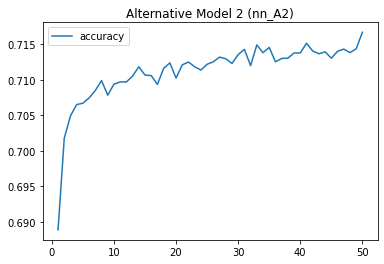

# VC Funding Analyzer

VC Funding Analyzer is a Python program which uses a machine learning algorithm to solve credit risk problem in a typical venture capital firm. Imagine, you work as a risk management associate at Alphabet Soup, a venture capital firm. Alphabet Soup’s business team receives many funding applications from startups every day. This team has asked you to help them create a model that predicts whether applicants will be successful if funded by Alphabet Soup.

The business team has given you a CSV file containing more than 34,000 organizations that have received funding from Alphabet Soup over the years. The CSV file contains a variety of information about each business, including whether or not it ultimately became successful. With your knowledge of machine learning and neural networks, you decide to use the features in the provided dataset to create a binary classifier model that will predict whether an applicant will become a successful business.

In order to assist the risk management associate, you will develop three different neural network models to see if any of the models can be promoted for production use. You may also apply some of the well known data preprocessing and neural network optimization design techniques while developing the deep neural network models. The binary classification model will be developed with the following high level steps:

* Preprocess data for a neural network model.
* Use the model-fit-predict pattern to compile and evaluate a binary classification model.
* Optimize the model with three different models to see any improvement in loss & accuracy of all three models.

The steps above will follow a typical ***model-fit-predict-evaluate*** pattern of implementing a machine learning algorithm in Python.

---

## Technologies

The project leverages Google Colab as a managed runtime hosted environment. Required Python libraries and dependencies can be installed in no time on Google Colab session.
* [Google Colab](https://colab.research.google.com/) - Colab allows anybody to write and execute arbitrary python code through the browser, and is especially well suited to machine learning, data analysis and education.

**Required Libraries:**

You may need the following key libraries to work with the program.

- [Pandas](https://pandas.pydata.org/docs/reference/index.html) - pandas is a Python package providing fast, flexible, and expressive data structures designed to make working with “relational” or “labeled” data both easy and intuitive.
- [TensorFlow](https://www.tensorflow.org/learn) - TensorFlow is a free and open-source software library for machine learning and artificial intelligence. It can be used across a range of tasks but has a particular focus on training and inference of deep neural networks.
- [scikit-learn](https://scikit-learn.org/stable/getting_started.html/) - Scikit-learn is an open source machine learning library that supports supervised and unsupervised learning.

---

## Usage

To use the VC Funding Analyzer application, clone the repository in your local workspace. Next, open [Google Colab](https://colab.research.google.com/) and upload **GC_venture_funding_with_deep_learning.ipynb**, which will load similar to a Jupyter Notebook web console. You may be prompted to upload a csv file 'applicants_data.csv' as an input. The CSV file is contained inside the Resources folder.

---

## Plotting the loss and accuracy scores of different neural network models

You may see the loss and accuracy scores of neural newtork models as shown below.

**Loss and accuracy scores of the original model**

 

**Loss and accuracy scores of the alternative model 1**

 

**Loss and accuracy scores of the alternative model 2**

 

---

## Contributors

FinTech Labs, Inc.

---

## License

None